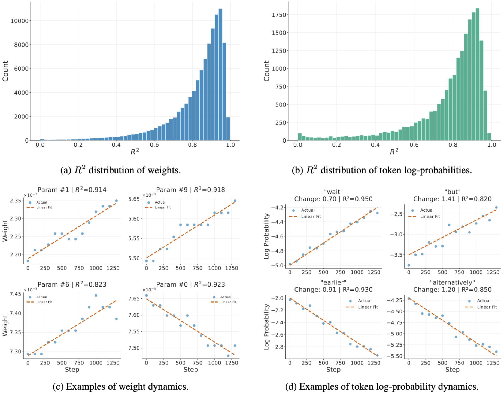
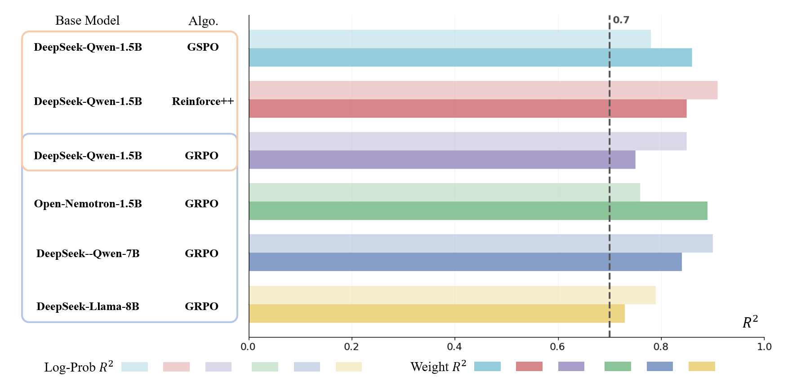
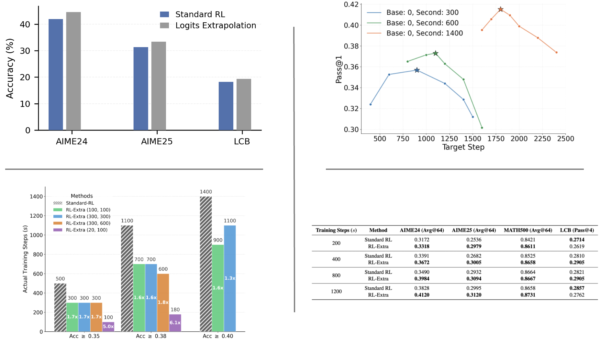

<div align="center">

# Not All Steps are Informative: On the Linearity of LLMs’ RLVR Training

[](https://arxiv.org/pdf/2601.04537v1)

<!-- Optional: Add License or Python version badges here -->
<!-- [](LICENSE) -->

</div>

> [!IMPORTANT]
> **🌟 Please consider giving us a star to stay updated on the upcoming code release!**

This repository contains the official implementation of the paper **"Not All Steps are Informative: On the Linearity of LLMs’ RLVR Training"**.

We uncover a significant phenomenon: **during RLVR (Reinforcement Learning with Verification Rewards), LLMs evolve in a strongly linear manner.** Motivated by this observation, we investigate whether future model states can be predicted from intermediate checkpoints via extrapolation, thereby bypassing expensive continued training.

<p align="center">

</p>

## 📊 Linearity Analysis

<p align="center">

</p>

**Figure 1: Linearity of model weights and outputs during RLVR training.**
(a) and (b) illustrate the distribution of $R^2$ scores for weights and token log-probabilities, respectively. Both distributions heavily concentrate around 0.9, indicating strong linearity.
(c) plots the trajectories of four randomly selected weights, while (d) tracks token log-probability shifts at four example positions.

<p align="center">

</p>

**Figure 2: Consistency across diverse setups.**
The linearity holds robustly across various settings. $R^2$ scores consistently exceed 0.7 (dashed line) regardless of the base model (e.g., DS-Qwen, DS-Llama), model scale (1.5B to 8B), or training algorithm (GSPO, Reinforce++, and GRPO).

## 🚀 Accelerating RLVR with linearities

Based on the linearity of RLVR training, we propose **Logits Extrapolation**, **Weight Extrapolation**, and **RL-Extra**. These methods allow us to predict model behavior at future steps using earlier trajectories, significantly accelerating training.

<p align="center">

</p>

**Key Findings:**
- **Logits Extrapolation:** Yields consistent accuracy improvements over standard RL on AIME and LiveCodeBench (LCB).
- **Weight Extrapolation:** Demonstrates high fidelity in predicting future weights on AIME24.
- **Efficiency:** Our methods significantly reduce the actual training steps required to reach target accuracy.
- **RL-Extra vs. GRPO:** Under fixed training budgets (actual steps $s$), RL-Extra consistently outperforms the GRPO baseline across AIME24, AIME25, MATH500, and LiveCodeBench.

## 🛠️ Usage

### 1. Environment Setup
Install the `verl` environment (ensure you are in the project root):

```bash
cd verl
pip3 install -e .[vllm]
```

### 2. Data Preparation
We use **DeepSeek-R1-Distill-Qwen-1.5B** as the base model.
1.  **Generate Responses:** We generated 64 responses for each AIME24 query. 
    *   Path: `evaluation/outputs/aime24_distill-qwen-1-5b.json`
2.  **Preprocessing:** Use the provided scripts to format data for RL training and evaluation within the `verl` framework.
    *   Script location: `verl/examples/data_preprocess`

> Note: The processed dataset is also available on our HuggingFace page.

### 3. RL Training (Baseline)
To reproduce the DeepScaleR baseline (using GRPO), run:

```bash
bash verl/examples/grpo_trainer/run_distill-qwen-1-5b_deepscaler.sh
```

### 4. Linearity Analysis
**Model Outputs (Token Log-probs):**
Use previously generated responses as probes to compute conditional log-probabilities for each token across checkpoints.

```bash
# 1. Compute log-probabilities
bash scripts/run_token_logprob_linearity.sh

# 2. Plot R^2 distribution
python3 analysis/token_logprob/plot_token_logprob_linearity.py
```

**Model Weights:**
Perform linear regression on model weights across training steps.

```bash
bash scripts/run_weight_linearity.sh
```

### 5. Extrapolation Methods & RL-Extra

| Method | Description | Command |
| :--- | :--- | :--- |
| **Logits Extrapolation** | Extrapolates logits to improve performance. | `bash scripts/run_logits_extrapolation.sh` |
| **Weight Extrapolation** | Extrapolates weights to accelerate RLVR. | `bash scripts/run_weight_extrapolation.sh` |
| **RL-Extra** | Corrects gradient trajectory for efficiency. | `bash scripts/run_rl_extrapolation.sh` |

### 6. Evaluation
**Inference (vLLM):**
```bash
python evaluation/inference_vllm_offline.py \
  --model_path deepseek-ai/DeepSeek-R1-Distill-Qwen-1.5B \
  --data aime24
```

**Metrics Calculation (pass@k, avg@k):**
```bash
python evaluation/pass_at_k_eval.py
```

## 🖊️ Citation

If you find this work helpful, please cite our paper:

```bibtex
@misc{wang2026stepsinformativelinearityllms,
      title={Not All Steps are Informative: On the Linearity of LLMs' RLVR Training}, 
      author={Tianle Wang and Zhongyuan Wu and Shenghao Jin and Hao Xu and Wei Chen and Ning Miao},
      year={2026},
      eprint={2601.04537},
      archivePrefix={arXiv},
      primaryClass={cs.LG},
      url={https://arxiv.org/abs/2601.04537}, 
}
```