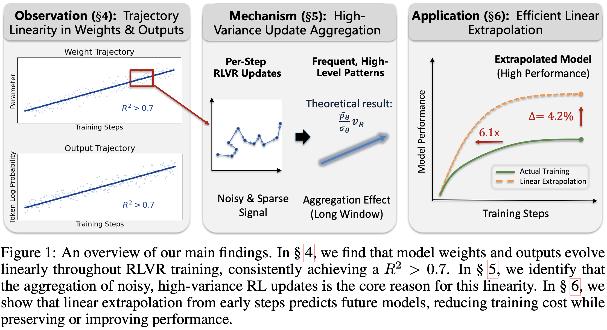
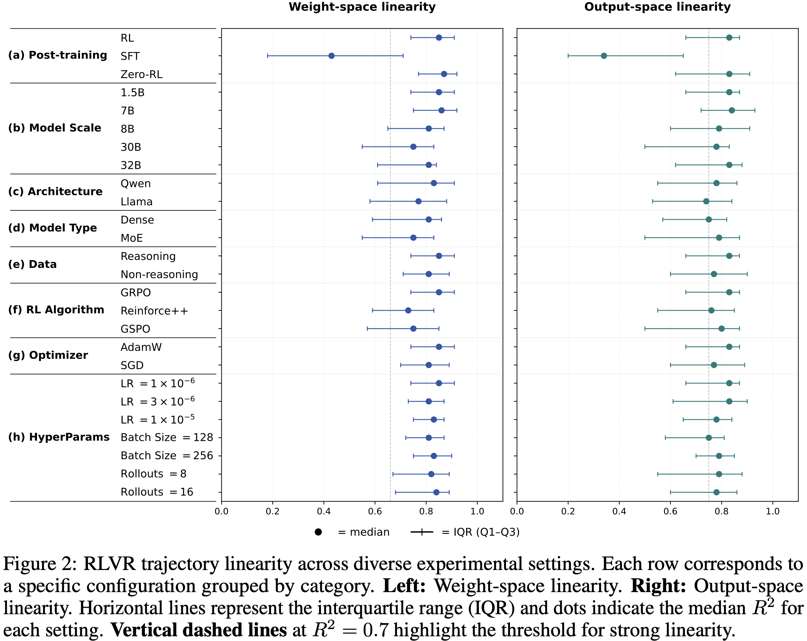
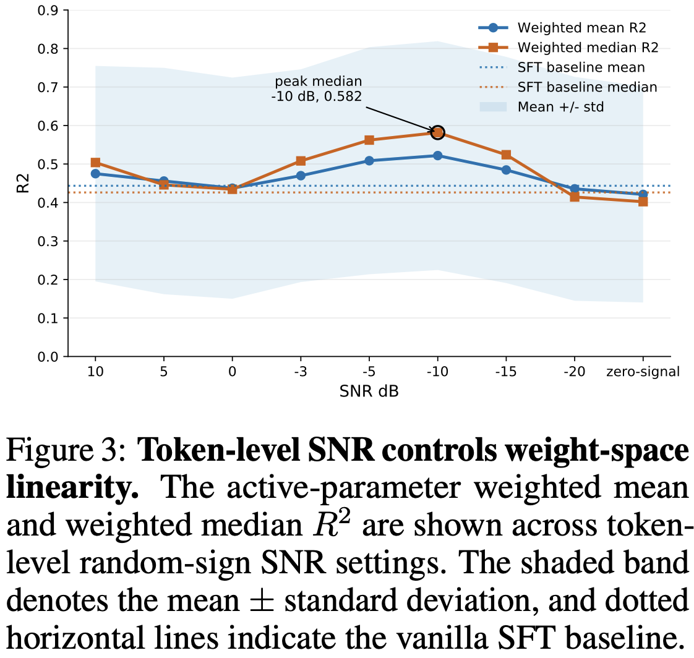
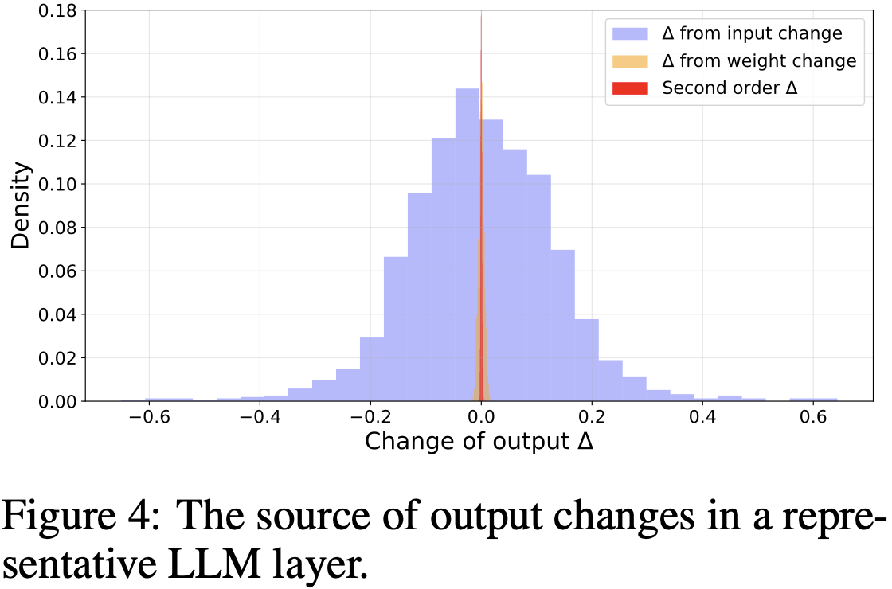
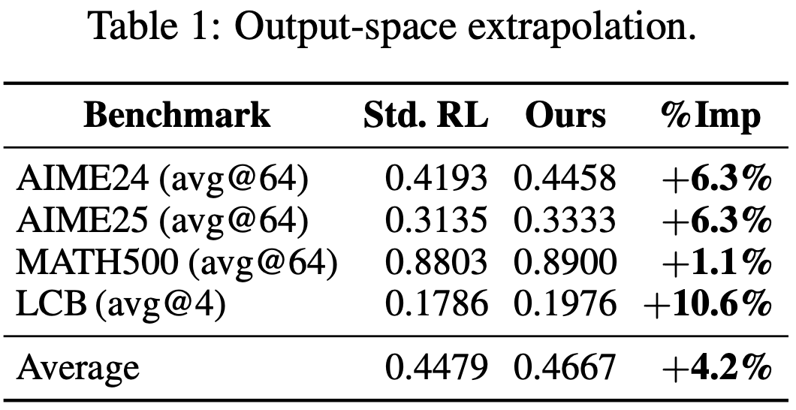
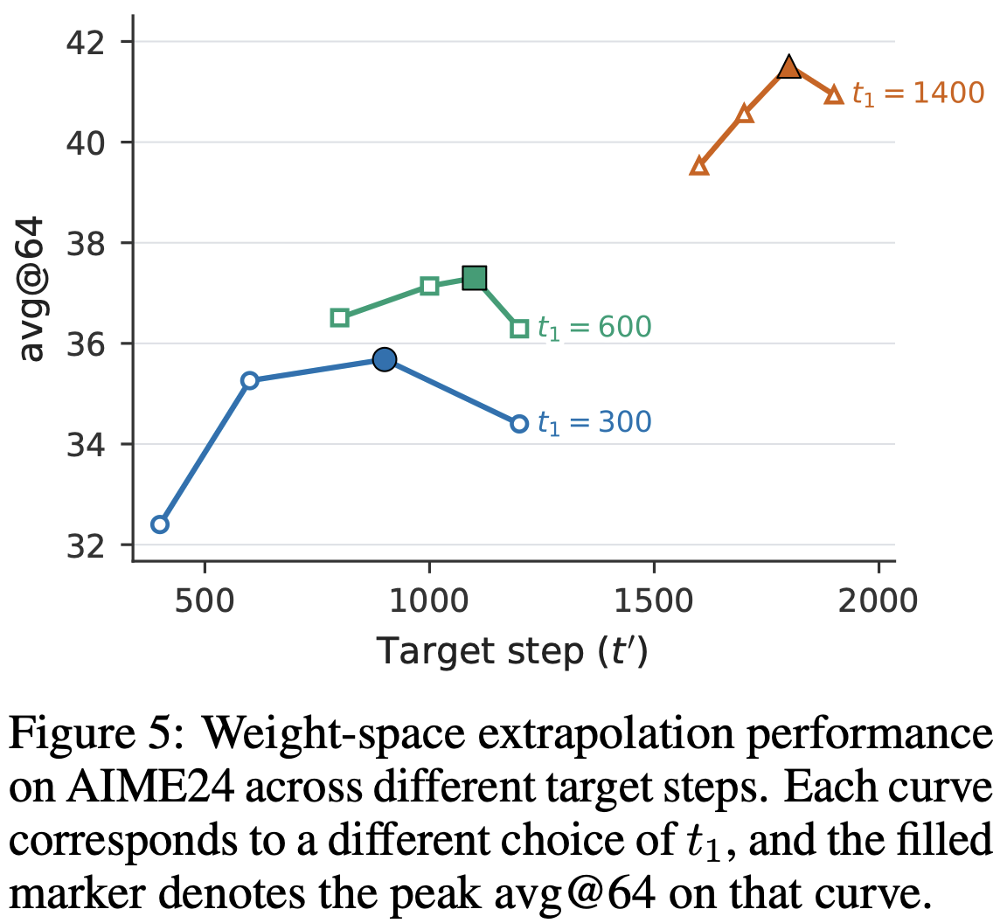
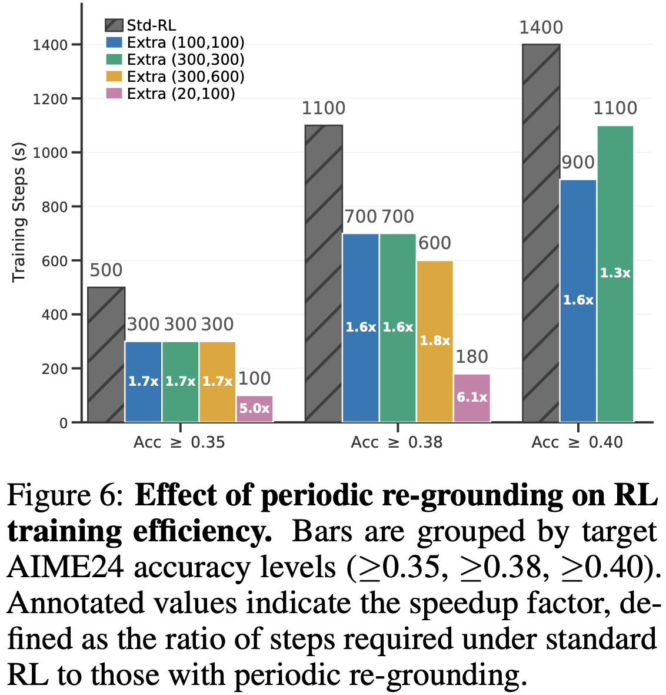
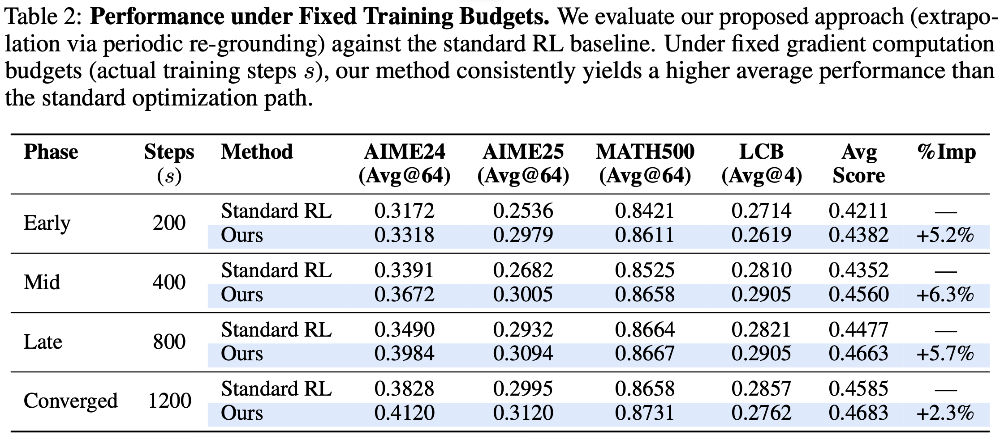

<div align="center">

# Linear Dynamics in the RLVR Training of Large Language Models

[](https://arxiv.org/abs/2601.04537v3)
[](https://huggingface.co/datasets/Miaow-Lab/RLVR-Linearity-Dataset)
[](https://huggingface.co/Miaow-Lab/RLVR-Linearity-Checkpoints)

<!-- Optional: Add License or Python version badges here -->
<!-- [](LICENSE) -->

</div>

> [!IMPORTANT]
> **🌟 If you find this repository useful, please consider giving it a star!**
> 
> **🔥 News**
> - **[2026/05]** We added more experiments and a more detailed explanation of this phenomenon.
> - **[2026/01]** We have released the full codebase, including linearity analysis, RL training on `verl`, acceleration methods, and evaluation scripts. Preprocessed RL [datasets](https://huggingface.co/datasets/Miaow-Lab/RLVR-Linearity-Dataset) and [checkpoints](https://huggingface.co/Miaow-Lab/RLVR-Linearity-Checkpoints) are now available.

This repository contains the official implementation of the paper **"Linear Dynamics in the RLVR Training of Large Language Models"**.

Reinforcement learning with verifiable rewards (RLVR) has become a key post-training stage for reasoning-oriented LLMs, but its internal training dynamics remain largely opaque. This work studies RLVR at the trajectory level and uncovers a **robust linear regime**: across model families, RL algorithms, and training configurations, both parameter weights and output log-probabilities evolve along highly linear directions.

The linear structure is not only descriptive. We show that noisy, high-variance RLVR reward signals can concentrate optimization into a stable low-dimensional drift, and that this structure can be used to predict future model states through output-space and weight-space extrapolation.

<p align="center">

</p>

## 📊 Linearity Analysis

We measure trajectory linearity with the coefficient of determination, $R^2$, over intermediate RLVR checkpoints. The main empirical finding is that RLVR trajectories are far more structured than their apparent complexity suggests:

- **Weight-space linearity:** Most trainable parameters are well approximated by linear trends during RLVR, with over 70% of weights achieving $R^2 > 0.7$ in the DeepScaleR setting.
- **Output-space linearity:** Token log-probabilities measured by teacher-forced evaluation also concentrate near high $R^2$ values, showing that the linear regime is reflected in model behavior rather than only in parameters.
- **Activation linearity:** Intermediate activations exhibit similar trends, linking linear weight evolution to downstream output changes.
- **Robustness:** The phenomenon persists across 13 settings spanning 1.5B-32B models, Qwen and Llama architectures, dense and MoE models, reasoning and non-reasoning data, GRPO, REINFORCE++, GSPO, different learning rates, batch sizes, and rollout counts.

<p align="center">

</p>

## 🔎 Origins of Linearity during RLVR

We test several plausible explanations and find that they do not fundamentally induce RLVR linearity. The linear regime persists when weights undergo non-trivial relative changes, when AdamW is replaced by vanilla SGD, and when RLVR is run without SFT initialization.

The key driver is the noisy and sparse nature of RLVR supervision. Since token-level credit is assigned from final answer correctness, per-step gradients contain high variance. When aggregated over long windows, these noisy updates cancel many fine-grained fluctuations and preserve frequent, high-level successful patterns. This acts like a low-pass filter, producing a stable drift direction in weight space.

Controlled noise-injection experiments support this mechanism: adding reward-style noise to SFT increases weight trajectory linearity, and the observed trend matches the theoretical account based on high-variance update aggregation.

<p align="center">

&nbsp;

</p>

## 🚀 Predictive Extrapolation of RLVR Trajectories

The robust linear regime enables direct prediction of future model states from earlier checkpoints.

- **Output-space Extrapolation:** Future logits are estimated from two earlier checkpoints, providing a training-free intervention that consistently improves over standard RL on AIME24, AIME25, MATH500, and LiveCodeBench, with a **+4.2%** average improvement.
- **Weight-Space Extrapolation:** Future parameters are predicted directly in weight space, producing complete lookahead models that closely match or improve upon continued RL training when extrapolation is moderate.
- **Periodic Re-grounding:** Standard RL updates are interleaved with gradient-free weight projections to control long-horizon extrapolation error. This improves performance under fixed training budgets and reaches up to a **6.1x** training speedup.

<p align="center">

&nbsp;

&nbsp;

</p>

<p align="center">

</p>

## 🛠️ Usage

### 1. Installation
Install the `verl` environment (ensure you are in the project root):

```bash
cd verl
pip3 install -e .[vllm]
```

### 2. Data Preparation
We utilize **DeepSeek-R1-Distill-Qwen-1.5B** as the base model.
1.  **Generate Responses:** We generated 64 responses for each AIME24 query. 
    *   Path: `evaluation/outputs/aime24_distill-qwen-1-5b.json`
2.  **Preprocessing:** Use the provided scripts to format data for RL training and evaluation within the `verl` framework.
    *   Script location: `verl/examples/data_preprocess`

> **Note:** The processed dataset is readily available on [HuggingFace Dataset](https://huggingface.co/datasets/Miaow-Lab/RLVR-Linearity-Dataset).

### 3. RL Training (Baseline)
To reproduce the DeepScaleR baseline (using GRPO), run the following command:

```bash
bash verl/examples/grpo_trainer/run_distill-qwen-1-5b_deepscaler.sh
```

<!-- > **Note:** Pre-trained RL checkpoints are available on [HuggingFace Models](https://huggingface.co/datasets/Miaow-Lab/RLVR-Linearity-Checkpoints). -->

### 4. Linearity Analysis
**Model Outputs (Token Log-probs):**
Use previously generated responses as probes to compute conditional log-probabilities for each token across checkpoints.

```bash
# 1. Compute log-probabilities
bash scripts/run_token_logprob_linearity.sh

# 2. Plot R^2 distribution
python3 analysis/token_logprob/plot_token_logprob_linearity.py
```

**Model Weights:**
Perform linear regression on model weights across training steps.

```bash
bash scripts/run_weight_linearity.sh
```

### 5. Extrapolation Methods & Periodic Re-grounding

| Method | Description | Command |
| :--- | :--- | :--- |
| **Logits Extrapolation** | Extrapolates logits to improve performance. | `bash scripts/run_logits_extrapolation.sh` |
| **Weight Extrapolation** | Extrapolates weights to accelerate RLVR. | `bash scripts/run_weight_extrapolation.sh` |
| **Periodic Re-grounding** | Corrects gradient trajectory for efficiency. | `bash scripts/run_rl_extrapolation.sh` |

### 6. Evaluation
**Inference (vLLM):**
```bash
python evaluation/inference_vllm_offline.py \
  --model_path deepseek-ai/DeepSeek-R1-Distill-Qwen-1.5B \
  --data aime24
```

**Metrics Calculation (pass@k, avg@k):**
```bash
python evaluation/pass_at_k_eval.py
```

## ✉️ Contact

For questions or feedback, please contact [Tianle Wang](mailto:louis.wng@outlook.com).

## 🖊️ Citation

If you find this work helpful, please cite our paper:

```bibtex
@misc{wang2026lineardynamicsrlvrtraining,
      title={Linear Dynamics in the RLVR Training of Large Language Models},
      author={Tianle Wang and Jiayu Liu and Zhongyuan Wu and Shenghao Jin and Wei Chen and Hao Xu and Ning Miao},
      year={2026},
      eprint={2601.04537},
      archivePrefix={arXiv},
      primaryClass={cs.LG},
      url={https://arxiv.org/abs/2601.04537},
}
```
